# Local LLM 사용 가이드

## 1. 에디터 설정

Local LLM은 **Zed Editor** 또는 **VSCode + Continue** 조합으로 사용할 수 있습니다.

### 1.1 Zed Editor 설정

#### 1.1.1 Zed 설치

- 설치 링크: https://zed.dev/

#### 1.1.2 AI 대화창 열기

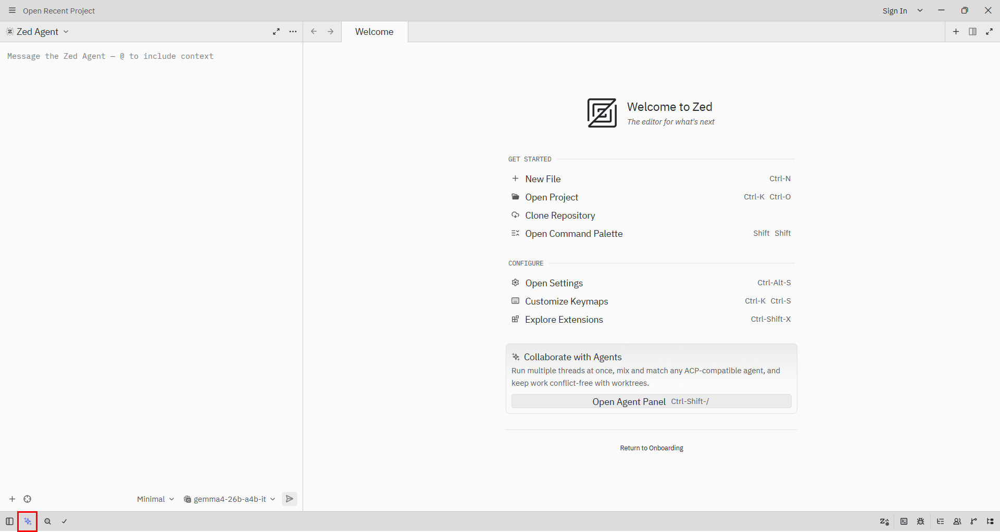

- 하단 바의 AI UI를 누르거나 `Ctrl + Shift + /`를 눌러 AI 대화창 Dock을 엽니다.

#### 1.1.3 Settings 열기

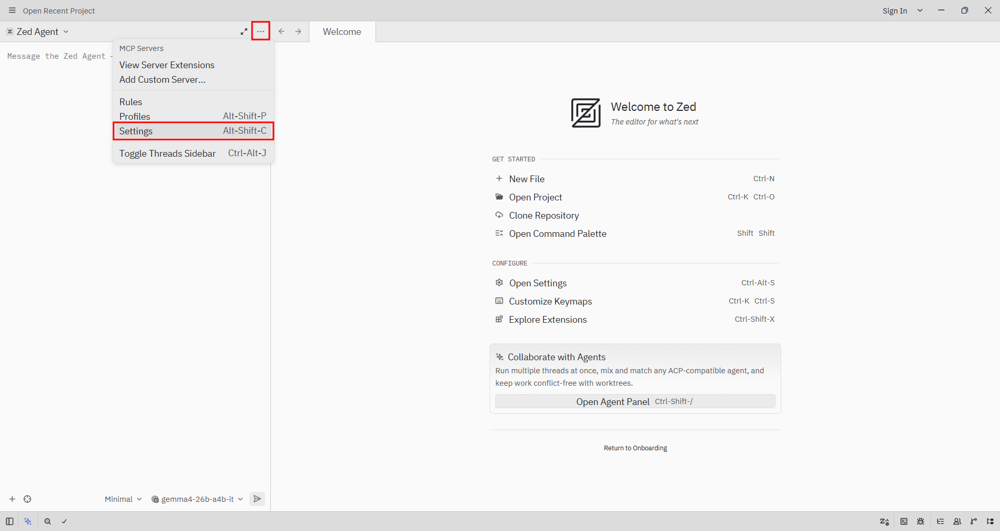

- Settings를 누르거나 `Alt + Shift + C`를 눌러 설정 화면으로 이동합니다.

#### 1.1.4 Provider 추가

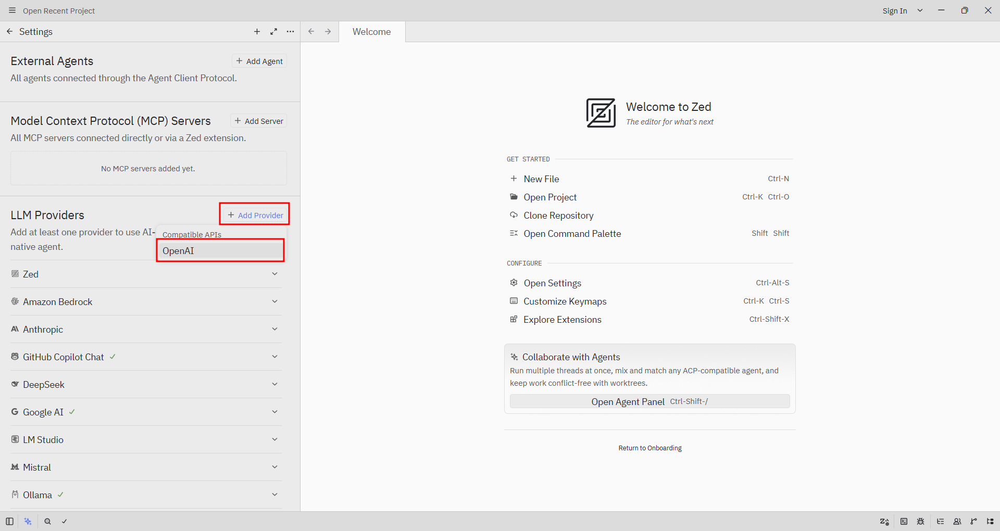

- `Add Provider -> OpenAI`를 선택합니다.

#### 1.1.5 Provider 정보 입력

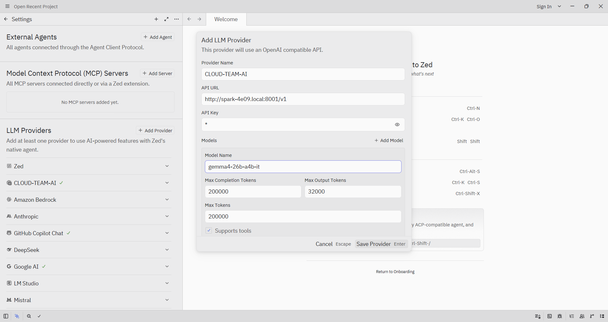

`Add LLM Provider` 모달에 아래 값을 입력합니다.

- Provider Name: 임의 값
- API URL: `http://spark-4e09.local:8001/v1`
- API Key: 필요 없으므로 Enter 한 번 입력
- Model Name: `gemma4-26b-a4b-it`

#### 1.1.6 모델 선택

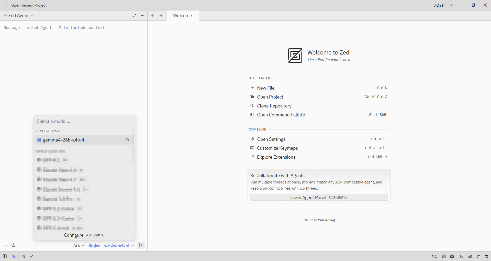

- 모델 선택 창에서 위에서 입력한 Provider Name과 `gemma4-26b-a4b-it`를 선택합니다.

#### 1.1.7 동작 확인

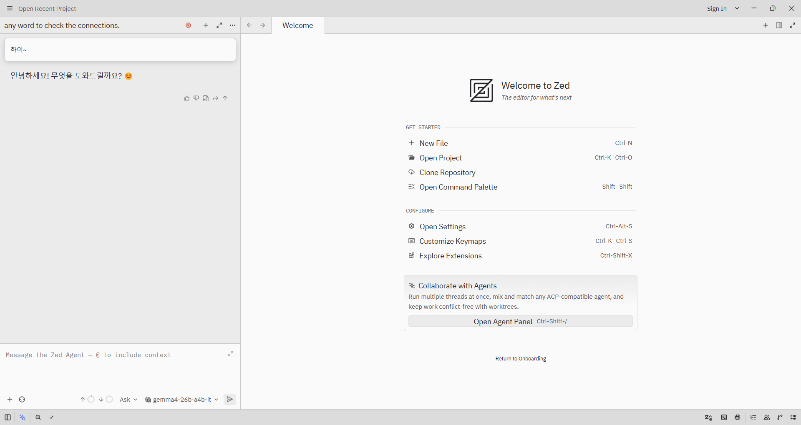

- 정상적으로 답변이 생성되는지 확인합니다.

### 1.2 VSCode + Continue 설정

#### 1.2.1 Continue 플러그인 설치

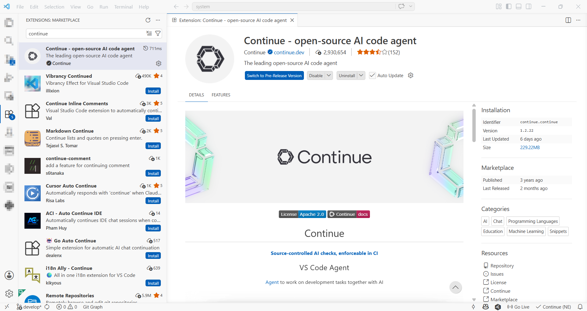

- 마켓플레이스에서 `continue` 플러그인을 설치합니다.

#### 1.2.2 Config 파일 입력

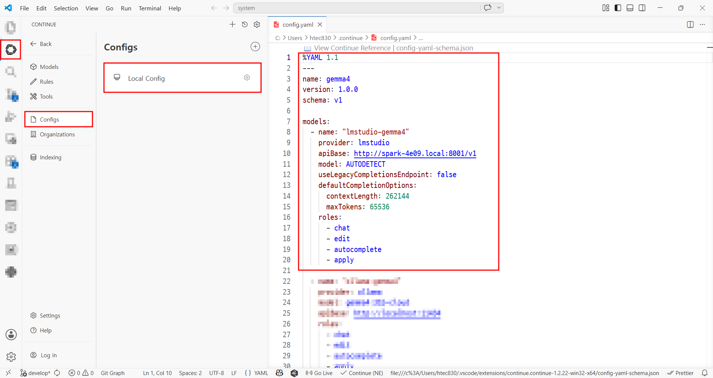

- Continue 아이콘 → Configs → Local Config를 열고 아래 내용을 입력합니다.

```yaml
models:
  - name: lmstudio-gemma4
    provider: lmstudio
    apiBase: http://spark-4e09.local:8001/v1
    model: "gemma4-26b-a4b-it"
    useLegacyCompletionsEndpoint: false
    defaultCompletionOptions:
      contextLength: 262144
      maxTokens: 65536
    capabilities:
      - tool_use
      - image_input
    roles:
      - chat
      - edit
      - apply
```

#### 1.2.3 동작 확인

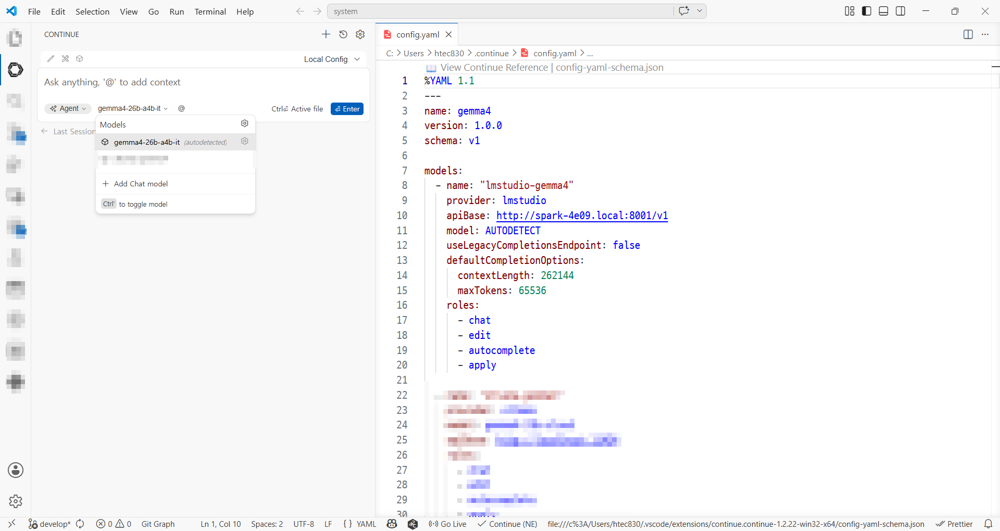
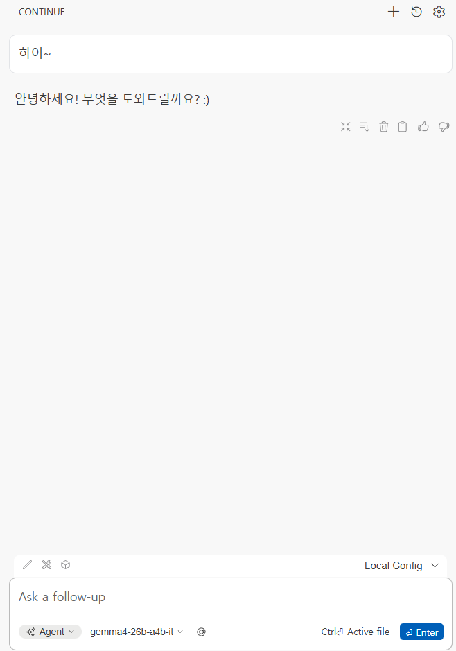

- 설정 후 질의/응답이 정상 동작하는지 확인합니다.

## 2. 사용 방법

일반적인 ChatGPT/Gemini 사용 방식과 동일하게 질의하면 됩니다. 다만, 작업 안정성을 위해 프로파일과 컨텍스트 설정을 함께 사용하는 것을 권장합니다.

### 2.1 프로파일 사용

#### 2.1.1 Zed 프로파일

- `Write`: 파일 수정 및 터미널 실행까지 가능한 전체 권한 프로파일
- `Ask`: 읽기 중심 프로파일(코드베이스 질의에 적합)
- `Minimal`: 도구 없이 대화만 수행하는 프로파일

#### 2.1.2 VSCode + Continue 모드

- **Chat mode**: 도구 없이 대화만 수행
- **Plan mode**: 읽기 중심 모드(탐색/계획 용도)
- **Agent mode**: 도구를 사용해 실제 수정까지 수행

### 2.2 컨텍스트 추가

#### 2.2.1 파일/폴더 추가

- `@` 입력 후 파일, 폴더 등을 컨텍스트에 추가할 수 있습니다.
- 이미지 포함 파일 첨부:
  - Zed: Drag & Drop
  - Continue: `Shift`를 누른 상태로 Drag & Drop

#### 2.2.2 Rules 추가

- Zed: 프로젝트 경로에 `.rules` 폴더를 만들고 규칙 파일을 추가합니다.
- Continue: `+` 버튼으로 rules 파일을 추가합니다.

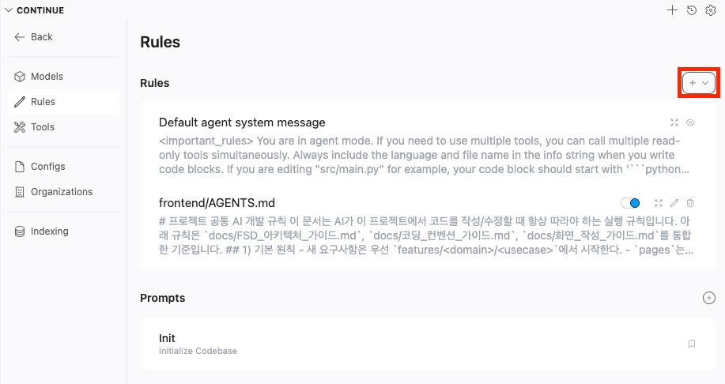

## 3. 사용 중 발생한 문제점

아래 사례가 발생하면 입력을 줄여 재시도하거나, 단계를 더 잘게 나눠 요청하세요.

### 3.1 코드가 의도와 다르게 제거됨

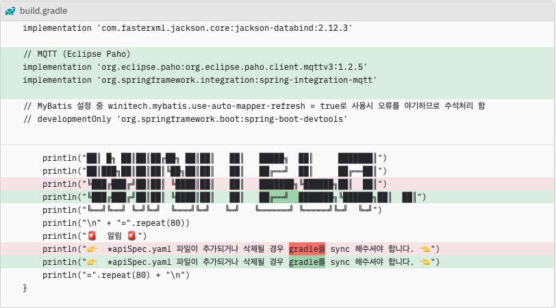

- 프롬프트 내용과 무관한 코드가 변경되는 경우가 있습니다.

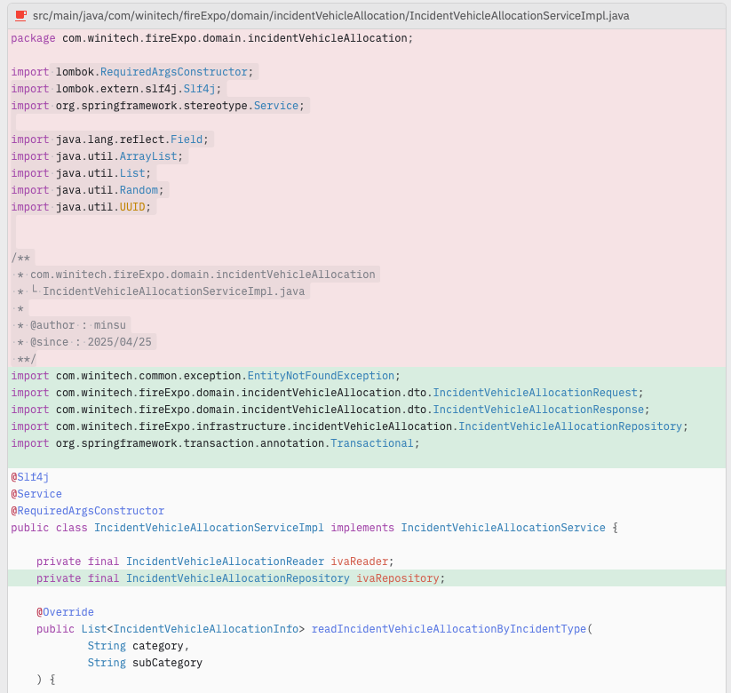

- 새로운 `import`를 작성하면서 기존 코드를 지워버리는 경우가 있습니다.

### 3.2 Tool Call 로그 노출 후 종료

```text
<|tool_call>call:list_directory{path:<|"|>system/src/main/java<|"|>}<tool_call|>

<|tool_call>call:create_directory{path:<|"|>test-service/src/main/java/com/winitech/testService/application/mqtt<|"|>}<tool_call|>

<|tool_call>call:edit_file{content:<|"|>package com.winitech.testService.infrastructure.mqtt;

<|"|>,display_description:<|"|>Wait, I am writing the implementation but I also need the interface if I want to use it.
```

- 응답 중 raw tool call 문자열이 노출되며 비정상 종료되는 경우가 있습니다.

### 3.3 단계가 뒤섞여 응답됨

```text
Step 5: Create IncidentVehicleAllocationController**

I will try to create the controller in `fire-expo/src/main/java/com/winitech/fireExpo/interfaces/inboundAdapter/web/`.
```

- 순차 진행 중 마지막 단계 파일 생성이 누락되고, 이전 단계 코드만 반환되는 경우가 있습니다.

### 3.4 답변이 깨진 채 종료됨

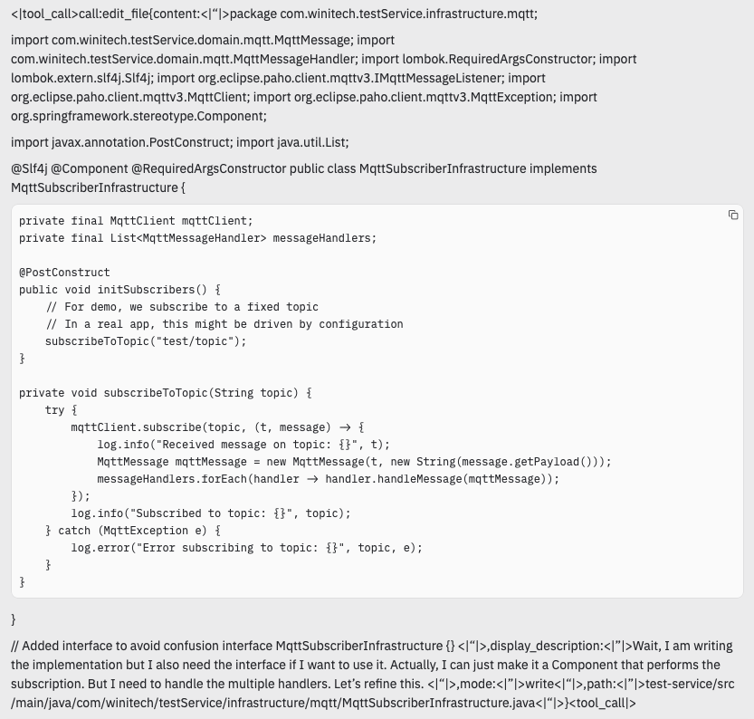

- Output Context가 길거나 tool call 오류가 발생하면 답변이 깨지며 종료될 수 있습니다.