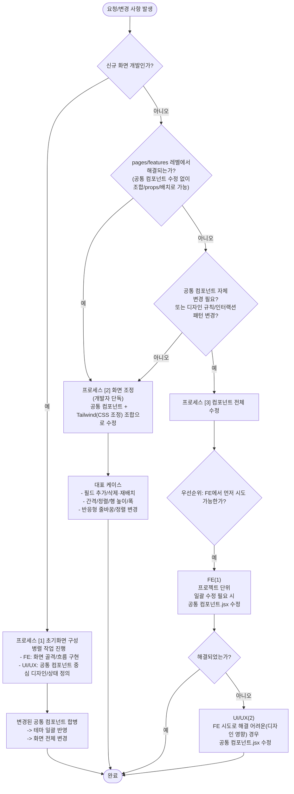

# 화면 작성 가이드

> **공통 컴포넌트**에는 웹 접근성 및 표준 UI/UX 룰이 최대한 반영되어 있습니다.

## 목차
- [1. 초기화면 구성(신규 화면 개발)](#1-초기화면-구성신규-화면-개발)
  - [팀별 작업 프로세스](#팀별-작업-프로세스)
  - [프론트엔드 개발 세부 프로세스 (권장)](#프론트엔드-개발-세부-프로세스-권장)
  - [신규 화면 체크리스트](#신규-화면-체크리스트)
- [2. 화면 조정(예: 텍스트 박스 추가 등)](#2-화면-조정예-텍스트-박스-추가-등)
  - [팀별 작업 프로세스](#팀별-작업-프로세스-1)
  - [프론트엔드 개발 세부 프로세스 (권장)](#프론트엔드-개발-세부-프로세스-권장-1)
    - [가능한 대표 케이스](#가능한-대표-케이스)
  - [예시 시나리오: SearchBar에 텍스트 박스 1개 추가](#예시-시나리오-searchbar에-텍스트-박스-1개-추가)
- [3. 번외) 컴포넌트 전체 수정](#3-번외-컴포넌트-전체-수정)
  - [팀별 작업 프로세스](#팀별-작업-프로세스-2)
  - [UI/UX 협업이 필요한 트리거(판단 기준)](#uiux-협업이-필요한-트리거판단-기준)
- [4. 의사결정 가이드](#4-의사결정-가이드)
  - [빠른 범위 판단 가이드](#빠른-범위-판단-가이드)
  - [전체 판단 가이드 차트](#전체-판단-가이드-차트)

---

## 1. 초기화면 구성(신규 화면 개발)

### 팀별 작업 프로세스

| 담당                  | 역할                                                                                                                  |
| :-------------------- | :-------------------------------------------------------------------------------------------------------------------- |
| **UI/UX 팀**          | • 프로젝트 테마 기준으로 컴포넌트.jsx 단위 디자인 작업 시작<br>• 공통 컴포넌트 중심으로 스타일/상태 정의 |
| **프론트엔드 개발팀** | • PM 표준 구조에 맞춰 화면 골격/흐름 구현<br>• UI/UX 영역과 충돌하지 않도록 “레이아웃/조합 중심”으로 진행    |

- PM이 잡아준 표준 구조(기본 골격)에 맞춰 **FE가 전체적인 구조와 로직을 개발하는 동시에 UI/UX는 컴포넌트 단위로 디자인을 진행합니다.**
- 최종적으로 UI/UX 팀이 변경한 공통 컴포넌트가 개발 코드에 합쳐지면 테마가 일괄 반영되어 **화면 전체가 변경되는 구조입니다.**

### 프론트엔드 개발 세부 프로세스 (권장)

1. 화면을 **영역(Area)** 으로 나눕니다. (예: Header / SearchBar / Content)
- 사용자 관리 페이지 예시


2. FSD 구조에 따라 나눈 각 영역을 pages에서 각각의 단일 **features**로 분리합니다.

- UserManagementPage.jsx 예시
```jsx
import { WiniFormNormal } from '@/shared/ui/blocks/form-layout';
import { UserListSearch, UserListGrid, useUserList } from '@/features/user/list';
import { UserEditor, useUserEditor } from '@/features/user/editor';

const UserManagementPage = () => {
  return (
    <WiniFormNormal>
      <UserListSearch
        searchParam={searchParam}
        orgList={orgList}
        onSearchChange={handleSearchChange}
        onKeyUp={handleKeyUpSearch}
        onSearch={handleSearch}
      />

      <UserListGrid
        userList={userList}
        onCellClick={handleRowClick}
        onJoinApproval={handleGridJoinApproval}
      />

      <UserEditor
        selectedUser={selectedUser}
        onChange={handleChange}
        onReset={handleReset}
        onCreate={handleCreate}
        onUpdate={handleUpdate}
        onDelete={handleDelete}
        onAcceptJoin={handleAcceptJoin}
        onResetPassword={handleResetPassword}
        onUnlockLogin={handleUnlockLogin}
      />
    </WiniFormNormal>
  );
};
```

3. 나눈 features는 WiniGridLayout / WiniGridItem와 같은 **Wini 공통 컴포넌트**로 세부 레이아웃을 정의합니다.

- 사용자 검색 컴포넌트 UserListSearch.jsx 예시
```jsx
export const Search = ({ searchParam, orgList, onSearchChange, onKeyUp, onSearch }) => {
  return (
    <WiniBox ui="search">
      <WiniSelect
        ui="column"
        name="organizationId"
        label="기관"
        value={searchParam.organizationId || ''}
        onChange={onSearchChange}
        onKeyUp={onKeyUp}
        displayEmpty
        labelProps={{ shrink: true }}
      >
        <WiniMenuItem value={''}>전체</WiniMenuItem>
        {orgList.map((item) => (
          <WiniMenuItem key={item.organizationId} value={item.organizationId}>
            {item.organizationName}
          </WiniMenuItem>
        ))}
        ...중략
```

4. pages/features를 구현할 때는 가능한 샘플 페이지를 참고하여 **공통 컴포넌트 조합**과 **Tailwind**로 구현합니다.
5. 또한 모든 코드는 FSD 구조에 따라 **ui는 ui/, 비즈니스 로직은 model/, api는 api/ 디렉토리에 별도 분리**합니다.

### 신규 화면 체크리스트

- [ ] GridLayout으로 영역 분리(레이아웃 먼저)
- [ ] 공통 컴포넌트 우선 사용(입력/버튼/테이블/모달 등)
- [ ] 화면별 커스텀 스타일은 Tailwind로 통일
- [ ] 기본 디자인(라벨/포커스/키보드 탐색) 공통 컴포넌트로 충족되는지 확인
- [ ] FSD 구조에 맞게 분리되었나 확인
- [ ] 컨벤션 룰이 적절하게 적용되었는지 확인

---

## 2. 화면 조정(예: 텍스트 박스 추가 등)

### 팀별 작업 프로세스

| 담당                  | 역할                                                                                                                  |
| :-------------------- | :-------------------------------------------------------------------------------------------------------------------- |
| **UI/UX 팀**          | ❌ |
| **프론트엔드 개발팀** | •  공통 컴포넌트 + Tailwind 조합으로 수정 진행    |

- 단순 조정은 UI/UX 팀까지 가지 않고 개발팀 선에서 공통 컴포넌트 + Tailwind 조합으로 처리합니다.

### 프론트엔드 개발 세부 프로세스 (권장)

1. 변경 사항이 공통 컴포넌트 조합으로 해결 가능한지 우선 검토합니다.
2. 이때 CSS 차원에서 조정이 가능하다면 Tailwind로 조정합니다. (공통 컴포넌트와 호환성 높음) 
2. 프로젝트 단위의 전체 공통 컴포넌트 내부 수정/정책 변경이 필요하면 프로세스 [3]으로 전환합니다.

#### 가능한 대표 케이스

- 필드 추가/삭제, 위치 재배치
- 간격/정렬/행 높이/폭 등 미세 조정
- 반응형 화면에서의 단순 줄바꿈/정렬 변경

### 예시 시나리오: SearchBar에 텍스트 박스 1개 추가

_요구: 사용자 관리 페이지 > 사용자 검색 컴포넌트 > “부서” 필드 추가_


- 대상 page 또는 feature를 선정하여 수정합니다. (샘플 페이지 참고)
```jsx
// UserListSearch.jsx
export const Search = ({ searchParam, orgList, onSearchChange, onKeyUp, onSearch }) => {
  return (
    <WiniBox ui="search">
      {/* 기존 코드 */}
      <WiniSelect
        ui="column"
        name="organizationId"
        label="기관"
        value={searchParam.organizationId || ''}
        onChange={onSearchChange}
        onKeyUp={onKeyUp}
        displayEmpty
        labelProps={{ shrink: true }}
      >
      ...중략
      
      {/* ✅ 추가: 부서 검색 텍스트 박스 */}
      <WiniText
        ui="column"
        name="departmentName"
        label="부서"
        value={searchParam.departmentName || ''}
        slotProps={{
          inputLabel: { shrink: true },
          input: { autoComplete: 'off' },
        }}
        onChange={onSearchChange}
        onKeyUp={onKeyUp}
        placeholder={'부서'}
      />
      ...중략
```

---

## 3. 번외) 컴포넌트 전체 수정

### 팀별 작업 프로세스

| 담당            |  우선순위 | 역할                                                                                                   |
| :------------ | :---: | :--------------------------------------------------------------------------------------------------- |
| **프론트엔드 개발팀** | **1** | • 프로젝트 단위 일괄적인 수정이 필요한 경우, **먼저** 해당 **공통 컴포넌트.jsx를 수정**                                             |
| **UI/UX 팀**   | **2** | • 프론트엔드 개발팀에서 시도한 방식으로 **해결이 어려운(디자인 영향) 경우**, 프로젝트 단위 일괄적인 수정을 위해 해당 공통 컴포넌트.jsx를 수정 |

- **우선 개발팀 내부에서 공통 컴포넌트 변형으로 해결 가능하면 가장 좋습니다.**
- 일관적인 **UI/UX 차원의 컴포넌트 수정**이 필요한 경우 해당 프로세스를 진행합니다.
- 이때 범위는 **해당 FE 프로젝트 전체**입니다. 
- 이 경우는 UI/UX팀과 협업하여 규칙/상태/변형을 정의합니다.

### UI/UX 협업이 필요한 트리거(판단 기준)

_아래 중 하나라도 해당하면 프로세스 [3]으로 분류합니다:_

- 공통 컴포넌트의 내부 마크업/레이아웃 구조 변경이 필요한 경우
- 컴포넌트의 상호작용 패턴 변경(포커스/키보드/validation/disabled/readOnly 등)
- 새 변형(variant/size/state) 추가가 필요한 경우(여러 화면에서 재사용될 가능성 고려)
- 반응형 규칙/정보 구조/시각적 룰이 바뀌는 수준의 변경

---

## 4. 의사결정 가이드

### 빠른 범위 판단 가이드
- **“레이아웃/간격/필드 추가”인가?** → **프로세스 [2]**
- **“공통 컴포넌트 자체를 바꿔야” 하는가?** → **프로세스 [3]**
- **“새 화면을 표준 골격으로 시작”하는가?** → **프로세스 [1]**

### 전체 판단 가이드 차트

