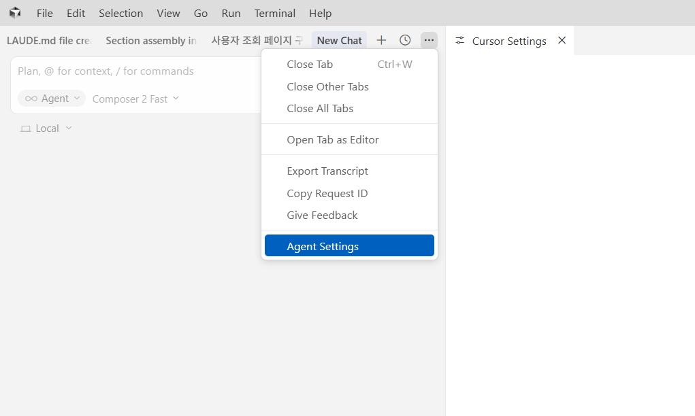
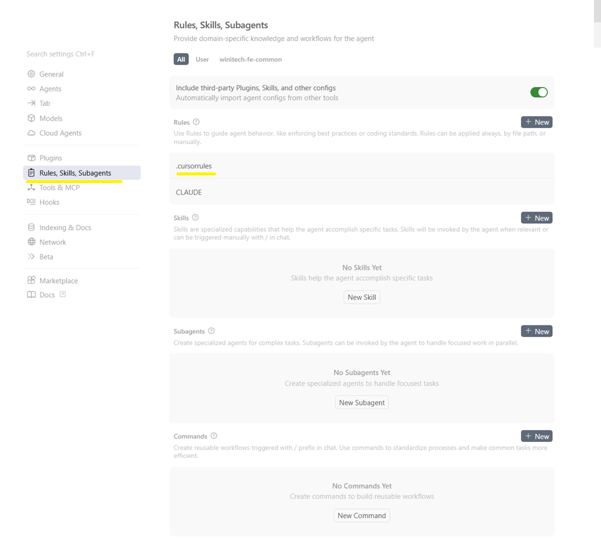
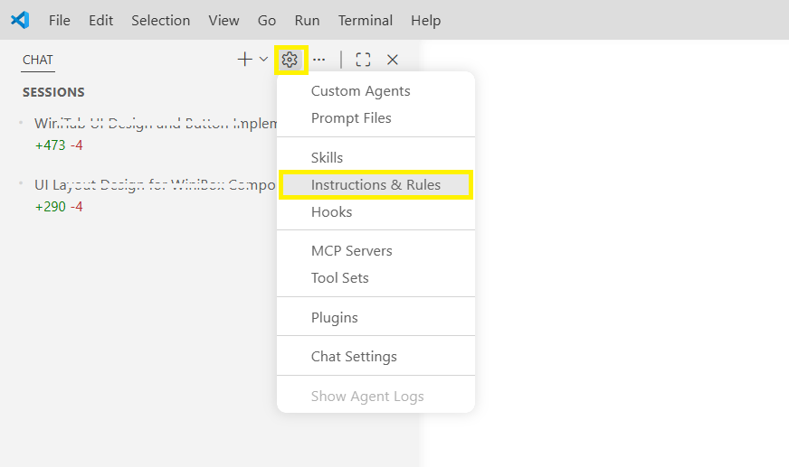
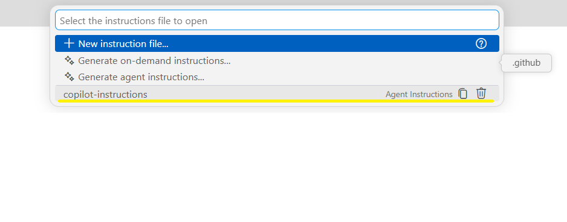

# AI Rules 적용 가이드

> 목표: AI 도구가 달라도 프로젝트 규칙을 **같은 기준**으로 따르도록 적용 방법을 통일합니다.

## 목차
- [1. 적용 대상과 기본 원칙](#1-적용-대상과-기본-원칙)
- [2. Cursor에서 적용 (`.cursorrules`)](#2-cursor에서-적용-cursorrules)
  - [2-4) Cursor UI에서 Rules 확인하기](#2-4-cursor-ui에서-rules-확인하기)
- [3. VS Code + GitHub Copilot에서 적용](#3-vs-code--github-copilot에서-적용)
  - [3-4) VS Code UI에서 Instructions 파일 확인하기](#3-4-vs-code-ui에서-instructions-파일-확인하기)
- [4. Claude에서 적용 (`CLAUDE.md`)](#4-claude에서-적용-claudemd)
- [5. VS Code + Codex에서 적용 (`.codex/AGENTS.md`)](#5-vs-code--codex에서-적용-codexagentsmd)
- [6. 기타 AI 도구 적용 패턴](#6-기타-ai-도구-적용-패턴)
- [7. 빠른 체크리스트](#7-빠른-체크리스트)

---

## 1. 적용 대상과 기본 원칙

- 이 프로젝트의 규칙 기준 문서는 다음과 같습니다.
  - `docs/FSD_아키텍처_가이드.md`
  - `docs/코딩_컨벤션_가이드.md`
  - `docs/화면_작성_가이드.md`
  - `src/pages/wini-samples`
- AI 도구별 설정 파일은 달라도, **실제 규칙 내용은 동일**해야 합니다.

이 프로젝트에서는 AI 규칙의 **단일 원본(Single Source of Truth)** 을 `docs/AI_RULES_MASTER.md` 로 둡니다. 규칙을 바꿀 때는 **항상 이 파일을 기준**으로 수정한 뒤, 도구별 파일에 같은 내용을 반영합니다.

### 1-1) 단일 원본 + 배포 파일

- **단일 원본(필수)**: `docs/AI_RULES_MASTER.md`  
  - FSD/코딩/화면 가이드(`docs/FSD_아키텍처_가이드.md` 등)를 통합한 실행 규칙 본문이 여기 있습니다.
  - 파일 상단의 YAML frontmatter(`description`, `alwaysApply` 등)는 일부 도구/설정에서 메타데이터로 쓰일 수 있으므로, 임의 삭제보다는 프로젝트 표준에 맞게 유지합니다.
- **도구별 배포 파일**(내용은 마스터와 **동일**해야 함):
  - `.cursorrules` — Cursor가 읽는 경로(루트)
  - `.github/copilot-instructions.md` — VS Code + GitHub Copilot
  - `CLAUDE.md` — Claude 계열 도구

배포 파일은 “요약본”이 아니라 **정책이 같아야 하는 동기화 대상**으로 취급합니다.

### 1-2) 변경 프로세스 (`docs/AI_RULES_MASTER.md` 기준)

1. **`docs/AI_RULES_MASTER.md` 를 먼저 수정**합니다. (새 규칙·금지사항·예시 변경 모두 여기서 반영)
2. 동일 본문을 **`.cursorrules`**, **`CLAUDE.md`**, **`.github/copilot-instructions.md`** 에 맞춥니다. (한쪽 배포 파일만 고쳐 정책을 바꾸지 않습니다.)
3. PR 설명 또는 체크리스트에 **“AI Rules: `docs/AI_RULES_MASTER.md` 및 배포 3종 동기화 여부”** 를 명시합니다.

`docs/FSD_아키텍처_가이드.md` 등 **상세 가이드만** 고친 경우에도, AI 실행 규칙에 영향이 있으면 `docs/AI_RULES_MASTER.md` 와 배포 파일을 함께 갱신했는지 확인합니다.

### 1-3) 충돌 방지 원칙

- 마스터와 배포 파일 간에 **규칙 의미가 달라지는 상태**를 두지 않습니다.
- 도구별 파일에서는 **형식/도구별 메타데이터**만 최소로 다를 수 있으며, **본문 정책**은 마스터와 같아야 합니다.
- 월 1회 이상 `docs/AI_RULES_MASTER.md` 중심으로 규칙·샘플 스니펫 점검을 권장합니다.

### 1-4) AGENTS.md
- 최근 다양한 AI 도구가 저장소 루트의 `AGENTS.md`를 공통 규칙 파일 경로로 채택하는 추세입니다.
- 도구별 지원 범위는 다를 수 있으므로, 실제 적용 전에는 사용 중인 AI의 공식 문서를 확인하는 것을 권장합니다.


---

## 2. Cursor에서 적용 (`.cursorrules`)

Cursor 사용자는 저장소 루트의 `.cursorrules`를 사용합니다.

### 2-1) 파일 위치

```txt
<repo-root>/.cursorrules
```

### 2-2) 적용 방법

1. 루트에 `.cursorrules` 파일을 둡니다.
2. 프로젝트 규칙(아키텍처/코딩/화면 작성)을 문서 형태로 작성합니다.
3. 팀에서 룰 변경 시 [§1](#1-적용-대상과-기본-원칙)의 절차에 따라 `docs/AI_RULES_MASTER.md` 를 먼저 수정한 뒤 `.cursorrules` 에 반영합니다.

### 2-3) 운영 팁

- 규칙 문구는 "해야 한다/금지"처럼 명확한 실행형 문장으로 작성합니다.
- 예제 스니펫(좋은/나쁜 예시)을 함께 두면 AI 출력 품질이 안정적입니다.

### 2-4) Cursor UI에서 Rules 확인하기

1. 채팅 화면 탭(**New Chat** 등) 오른쪽 상단의 `···`(더보기)를 누른 뒤 **Agent Settings**를 선택합니다.



2. 설정에서 **Rules, Skills, Subagents**로 이동하면 이 워크스페이스에 연결된 규칙(예: `.cursorrules`, `CLAUDE.md` 등)을 확인·관리할 수 있습니다.



---

## 3. VS Code + GitHub Copilot에서 적용

VS Code에서 Copilot을 사용할 때는 저장소의 Copilot 전용 지시 파일을 사용합니다.

### 3-1) 파일 위치

```txt
<repo-root>/.github/copilot-instructions.md
```


### 3-2) 적용 방법

1. 루트에 `.github/copilot-instructions.md`를 생성합니다.
2. `docs/AI_RULES_MASTER.md`(또는 동기화된 `.cursorrules`) 핵심 규칙을 Copilot 문맥에 맞게 정리합니다.
3. PR 리뷰 시 Copilot 제안 코드가 규칙을 지켰는지 체크합니다.

### 3-3) 권장 작성 항목

- 아키텍처 규칙(FSD 레이어/의존/공개 API)
- 코드 스타일 규칙(네이밍/export/import)
- UI/상태/에러 처리 규칙
- 금지 목록(window alert/직접 fetch/axios 등)

### 3-4) VS Code UI에서 Instructions 파일 확인하기

1. **CHAT** 사이드바 오른쪽 상단의 톱니바퀴(설정)를 누른 뒤 **Instructions & Rules**를 선택합니다.



2. 프로젝트 루트의 `.github`에 둔 `copilot-instructions`가 보이면 해당 지시파일이 적용된 상태 입니다. 추가로 더 추가를 원하면 **New instruction file** 을 사용 하여 추가할수 있습니다.



---

## 4. Claude에서 적용 (`CLAUDE.md`)

Claude 계열 도구(예: Claude Code)를 사용할 경우 저장소 루트의 `CLAUDE.md`를 사용합니다.

### 4-1) 파일 위치

```txt
<repo-root>/CLAUDE.md
```

### 4-2) 적용 방법

1. `CLAUDE.md`를 루트에 둡니다.
2. `docs/AI_RULES_MASTER.md` 와 동일한 규칙을 반영합니다.
3. 규칙 변경 시 [§1](#1-적용-대상과-기본-원칙)에 따라 마스터를 먼저 수정한 뒤 배포 파일을 맞춥니다.

### 4-3) 현재 프로젝트 권장 상태

- 규칙 **단일 원본**: `docs/AI_RULES_MASTER.md` (상세는 [§1](#1-적용-대상과-기본-원칙) 참고)
- `.cursorrules`: Cursor용 배포 파일
- `CLAUDE.md`: Claude용 배포 파일
- 배포 파일 본문은 마스터와 동일하게 유지

---
## 5. VS Code + Codex에서 적용 (`.codex/AGENTS.md`)

VS Code에서 Codex를 사용할 때는 저장소 루트의 Codex 전용 지시 파일을 사용합니다.

### 5-1) 파일 위치

```txt
<repo-root>/.codex/AGENTS.md
```

### 5-2) 적용 방법

1. 루트에 `.codex/AGENTS.md` 파일을 둡니다.
2. `docs/AI_RULES_MASTER.md` 와 동일한 규칙을 반영합니다.
3. 규칙 변경 시 [§1](#1-적용-대상과-기본-원칙)에 따라 마스터를 먼저 수정한 뒤 Codex 배포 파일을 동기화합니다.

---

## 6. 기타 AI 도구 적용 패턴

도구마다 파일명은 달라도 운영 방식은 동일합니다.

### 6-1) 공통 패턴

1. 도구가 읽는 "프로젝트 규칙 파일" 위치를 확인
2. 기존 규칙 핵심(아키텍처/코딩/화면/금지사항) 복사
3. 도구 특성에 맞는 표현으로 최소 보정
4. 샘플 코드와 체크리스트 포함

### 6-2) 최소 포함 권장 항목

- 레이어/의존성 규칙
- import/export 규칙
- 상태/비동기/에러 처리 규칙
- UI 컴포넌트 우선순위와 스타일 규칙
- 금지 목록 요약

---

## 7. 빠른 체크리스트

- [ ] 단일 원본 `docs/AI_RULES_MASTER.md` 가 최신 상태임
- [ ] Cursor: `.cursorrules` 가 마스터와 동기화됨
- [ ] Copilot: `.github/copilot-instructions.md` 가 마스터와 동기화됨
- [ ] Claude: `CLAUDE.md` 가 마스터와 동기화됨
- [ ] Codex: `.codex/AGENTS.md` 가 마스터와 동기화됨
- [ ] AGENTS: `AGENTS.md` 가 마스터와 동기화됨
- [ ] 마스터와 배포 5종의 핵심 정책이 동일함
- [ ] 최근 변경이 마스터 기준으로 반영됨
